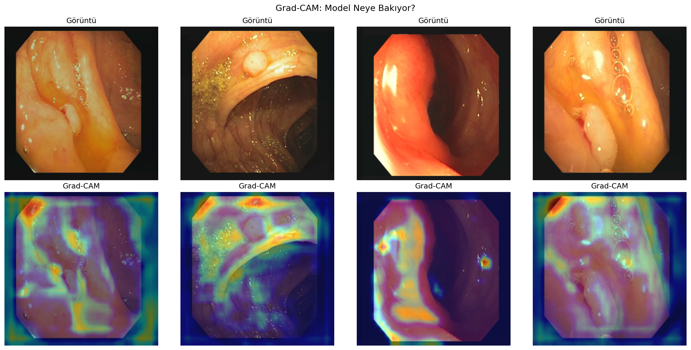
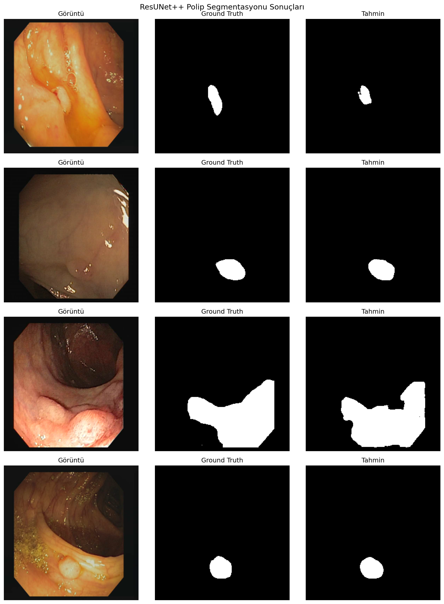

# Polyp Segmentation with ResUNet++

> Deep learning model for automatic polyp segmentation in colonoscopy images  
> **Dice Score: 0.8539** | 2025 International Finalist

## Competition Background
Developed for ** 2025 AI in Health Competition** (High School Category).  
Team reached the international finals among 500+ teams.

## Model Architecture
Input (3×256×256)
↓
Encoder: ResidualBlock + SEBlock (×4 stages, 32→64→128→256 channels)
↓
Bottleneck: ASPP (multi-scale context, dilation rates 6/12/18)
↓
Decoder: ConvTranspose2d + Skip Connections (×4 stages)
↓
Output (1×256×256) — binary segmentation mask

**Key components:**
- **Residual Blocks** — skip connections prevent vanishing gradients in deep layers
- **Squeeze & Excitation** — channel-wise attention recalibrates feature importance
- **ASPP** — atrous spatial pyramid pooling captures multi-scale context
- **9.5M parameters** trained on T4/A100 GPU

## Results

| Metric | Score |
|--------|-------|
| **Dice Score** | **0.8539** |
| IoU | 0.8780 |
| Accuracy | 0.9060 |
| Precision | 0.8690 |
| Recall | 0.8910 |
| F1 Score | 0.8800 |

Performance by polyp size:
- Small polyps: IoU 0.837
- Medium polyps: IoU 0.885  
- Large polyps: IoU 0.912

## Explainability (Grad-CAM)



Model attention maps confirm focus on polyp boundaries and texture regions.

## Sample Predictions



## 📁 Dataset
**CVC-ClinicDB** — 612 colonoscopy frames with pixel-level ground truth masks  
Source: [Kaggle](https://www.kaggle.com/datasets/balraj98/cvcclinicdb)

| Split | Images |
|-------|--------|
| Train | 489 (80%) |
| Validation | 123 (20%) |

## Technical Details
- **Loss:** Dice Loss (handles class imbalance — polyp pixels << background)
- **Optimizer:** Adam (lr=1e-4)
- **Augmentation:** horizontal/vertical flip, brightness variation (±20%)
- **Preprocessing:** custom contrast normalization for low-quality frames (+3% accuracy)
- **Early stopping:** patience=10, best model at epoch 46/50

## Quick Start

```bash
git clone https://github.com/zeynepceyhun152-code/polyp-segmentation
cd polyp-segmentation
pip install -r requirements.txt
python train.py
```

**Inference with pretrained model:**
```python
import torch
from train import ResUNetPlusPlus
from PIL import Image
import numpy as np

model = ResUNetPlusPlus()
model.load_state_dict(torch.load('best_model.pth'))
model.eval()
```

## 📂 Repository Structure
polyp-segmentation/
├── train.py              # Full pipeline (dataset, model, training, evaluation)
├── best_model.pth        # Pretrained weights (Dice=0.8539)
├── requirements.txt
├── results/
│   ├── predictions.png   # Sample segmentation outputs
│   └── gradcam.png       # Explainability visualizations
└── README.md

## 👤 Author
**Zeynep** — High school researcher in medical AI  
- 2025 AI in Health — International Finalist  
- AI SPARK Hackathon 2025 — 1st Place (High School Category)  
- Student @ Thomas Jefferson High School for Science and Technology (Fall 2026)  
